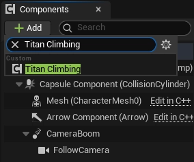
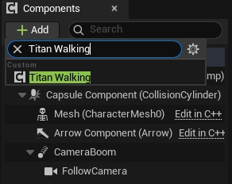
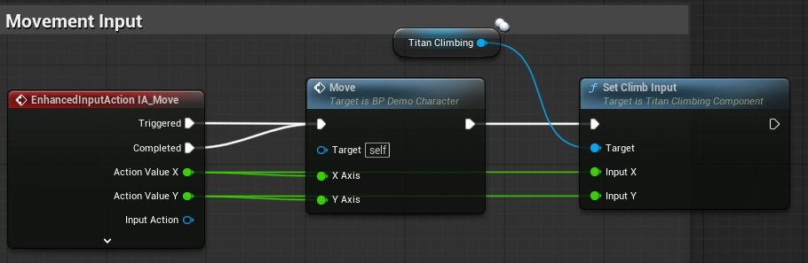
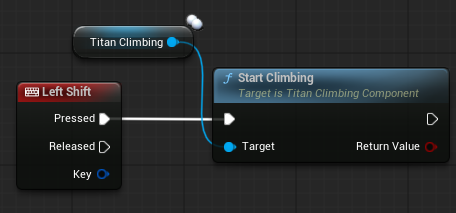

## 1. Open the player Character Blueprint

Open your primary player character Blueprint. The owner must be an `ACharacter`: the climbing component reads its capsule, movement component, skeletal mesh, and animation instance.

## 2. Add the components

Add a **Titan Climbing** component in the Components panel. It makes your character climbing!

Add a **Titan Walking** component when the character must walk on a moving skeletal climbable. It creates a local collision patch from nearby animated surface triangles.

## 3. Configure climbing

Assign a `Titan Climb Rig Profile` that matches the character skeleton. The profile defines each hand and foot's effector/IK bones, probe origin, reach limits, and animation curves.

- Aware that **Climbable Trace Channel** property is for climbing static meshes.

To use climb-up and climb-exit transitions, use an Animation Blueprint derived from `UTitanClimbAnimInstance` and assign its montages.

## 4. Attach input

Send the normalized 2D movement input used by the character to **Set Climb Input**. It moves the character along the active surface while climbing.

In this tutorial, we will just use simple input binding for `Start Climbing`.

Bind separate actions as appropriate for your game:

- **Start Climbing** to query the surface in front of the character.
- **Stop Climbing** to return to the idle state.

`StartClimbing` succeeds only when it finds a valid climbable surface that meets the component's distance, angle, and facing requirements.
