## 0. Create a Titan Character

On this tutorial, we will just climb up the Mannequins, which Unreal Engine provides. So, let’s start with a **Character** blueprint class.

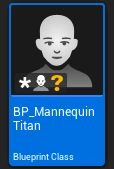

Then, set its **Mesh** as SKM_Manny_Simple(and apply some simple transform settings).

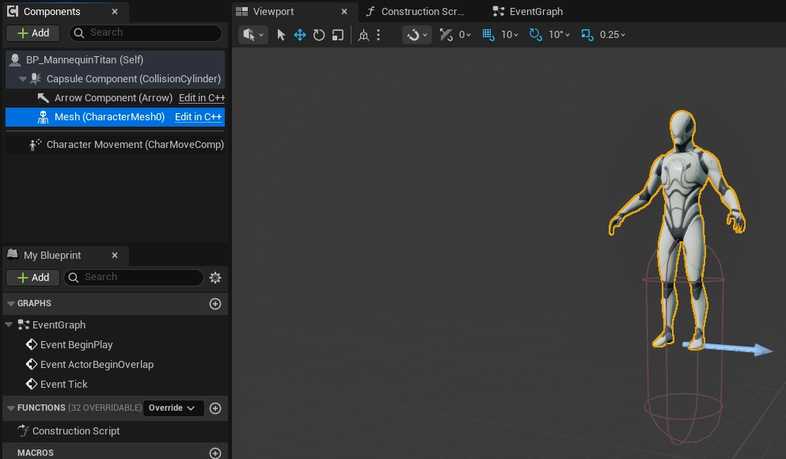

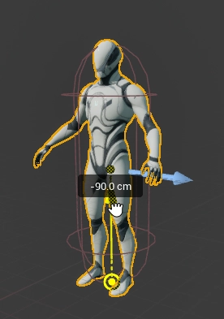

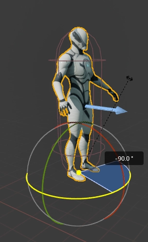

Additionally, our player character will be close to the titan for climbing. So let’s change some collision preset. (You have to change both, the **Capsule Component** and the **Mesh**.)

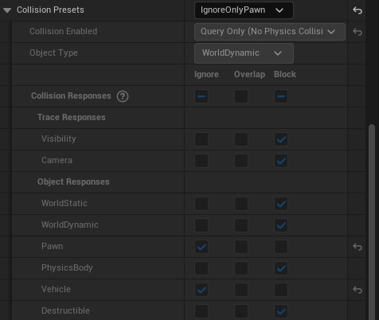

Next, add a **Titan Climbable** component. This component will make this character to be the target of **Titan Climbing** component.

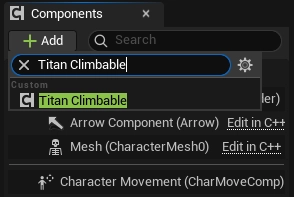

This component has very simple property. It just handles a surface asset.

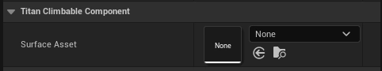

---

## 1. Create a Titan Surface Asset

To create **Titan Surface** asset, right-click the Content Browser. In Miscellaneous tab, you can find the Titan Surface asset that our plugin provides.

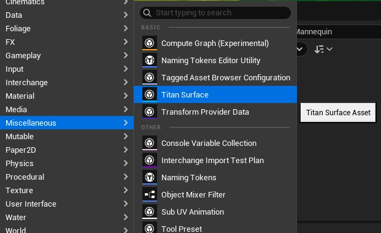

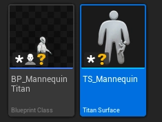

In asset editor, you can see the empty viewport and some properties.

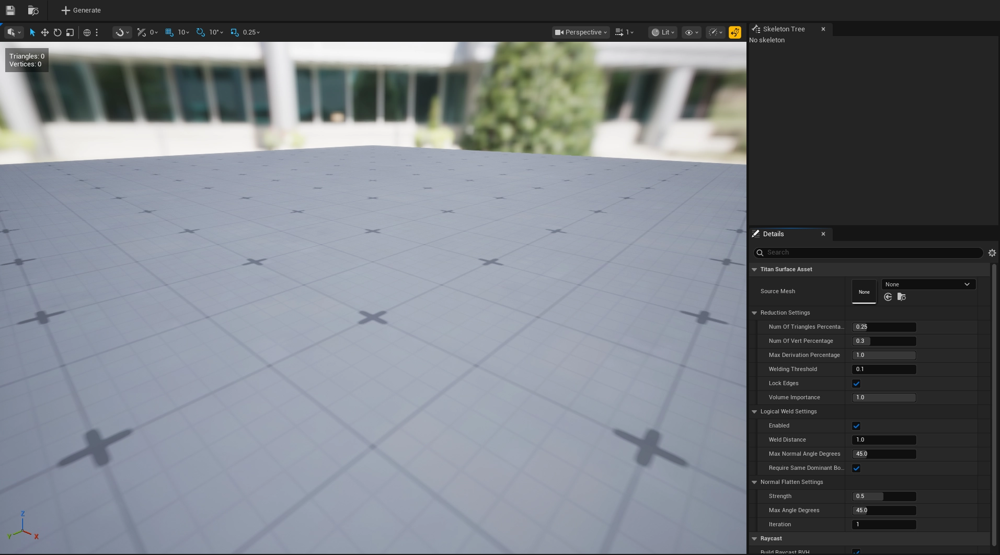

First, let’s set the **Source Mesh**. Our titan mesh was **SKM_Manny_Simple**, so we have to use same mesh in this asset.

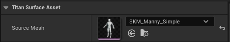

Next is some surface generation settings. It is some extra settings so you can check it later. (Link)

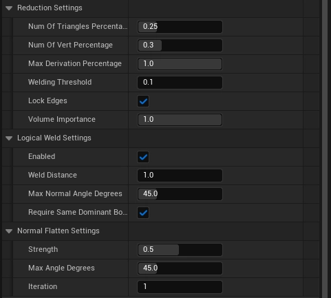

The last one is boolean flag for building BVH. Our plugin uses BVH for **super fast** line tracing/shape sweeping. So we recommend to check this flag as true.

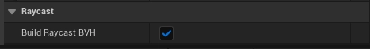

And click the Generate button above the tab bar.

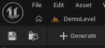

Then you can see the surface for climbing! Green lines mean the triangle, and red lines mean the normal of the vertex. You can also turn off the lines for normal by using show flags.

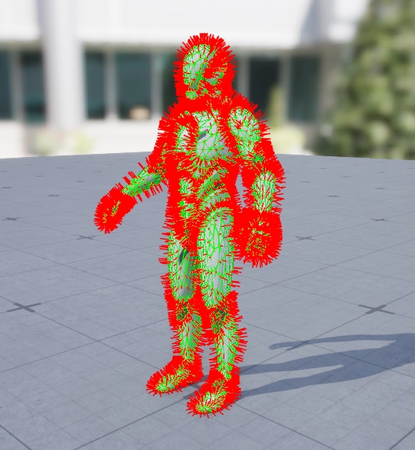

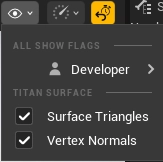

Last, attach the surface asset in the **Titan Climbable** component.

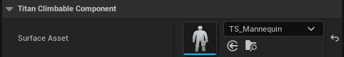
