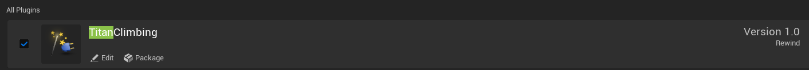

## Before you begin

This guide uses the Unreal Engine Third-Person template as a baseline. The plugin contains two modules:

- `TitanClimbing` is the runtime module used by characters and climbable actors.
- `TitanClimbingEditor` provides the **Titan Surface** asset editor and surface generator.

The plugin also enables Unreal's `ControlRig` and `FullBodyIK` plugins. Ensure those dependencies remain enabled.

## 1. Enable the plugin

1. Navigate to **Edit > Plugins** in Unreal Engine.
2. Search for `Titan Climbing` and enable it.
3. Restart the editor if prompted.

## Setup order

1. [Create Climbing Player](./create-player/) — add the character-side components, input, rig profile, and Animation Blueprint.
2. [Create Climbable Titan](./create-titan/) — register a skeletal target as a climbable actor.
3. [Create Titan Surface](./create-titan-surface/) — generate the animated surface data and assign it to the Titan.

> The player and climbable actor must use a collision/trace setup compatible with the `Climbable Trace Channel` configured on `UTitanClimbingComponent`.
